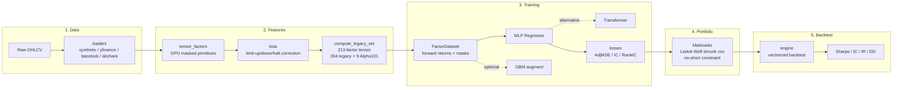

# ml-quant-trading

**A reproducible PyTorch stack for cross-sectional factor research — from 213
mask-aware factors to cost-aware portfolios, backtests, and auditable reports.**

[](https://github.com/initial-d/ml-quant-trading/actions/workflows/ci.yml)
[](https://github.com/initial-d/ml-quant-trading/stargazers)
[](https://github.com/initial-d/ml-quant-trading/releases)
[](https://pypi.org/project/mlquantx/)
[](https://arxiv.org/abs/2507.07107)
[](https://github.com/initial-d/dsh-plugin-mlquant-benchmark)
[](https://www.python.org/downloads/)
[](LICENSE)

Languages: [English](README.md) | [简体中文](README.zh-CN.md) | [繁體中文](README.zh-TW.md)

[**Run in Colab**](https://colab.research.google.com/github/initial-d/ml-quant-trading/blob/main/notebooks/quickstart_colab.ipynb)
· [**Agent benchmark challenge**](docs/agent_quant_benchmark_challenge.md)
· [**Inspect the benchmark**](docs/benchmark_board.md)
· [**Run with DSH**](docs/deepseek_harness_recipe.md)
· [**See cost-aware results**](docs/validation_dashboard.md)
· [**Read the paper**](https://arxiv.org/abs/2507.07107)

## Quick Start

```bash
python -m pip install mlquantx
mlquant demo
```

No market-data account or API key is required. In 30–90 seconds, the
deterministic demo runs data → factors → model → portfolio → backtest and writes
shareable Markdown and JSON reports.

Once it runs, you can [inspect the benchmark](docs/benchmark_board.md) or
[share a reproduction report](https://github.com/initial-d/ml-quant-trading/issues/new?template=reproduction_report.yml).
If the baseline is useful, a Star helps other researchers find it.
Evaluating privately? Use the
[private evaluation checklist](docs/private_evaluation_checklist.md) or submit a
[redacted evaluation note](https://github.com/initial-d/ml-quant-trading/issues/new?template=private_evaluation_note.yml)
without exposing proprietary data, positions, or strategy details.

| 213 factors | 4 data paths | 100 tests | CPU/GPU benchmark |
|---:|---:|---:|---:|
| Mask-aware PyTorch tensors | Synthetic, AkShare, Baostock, yfinance | Deterministic engineering checks | Reproducible across machines |

See the [benchmark board](docs/benchmark_board.md) for complete environments,
commands, and raw results. Cross-machine snapshots are reported separately and
are not presented as controlled hardware rankings.

---

## Why this repository?

| You get | Why it matters |
|---|---|
| **213 factor dimensions** | Mask-aware PyTorch factors with documented families and tensor primitives |
| **One end-to-end path** | Data → factors → models → portfolio → cost-aware backtest → report |
| **Public and synthetic data** | Start without proprietary data or an API key, then move to AkShare, Baostock, or yfinance |
| **Evidence, including failures** | Costs, turnover, baselines, caveats, and negative results stay visible |
| **A contribution path** | CI, tests, report templates, Colab, and newcomer-sized research tasks |

Try the live Hugging Face artifacts: the
[100,000-row synthetic dataset](https://huggingface.co/datasets/dddyym/ml-quant-trading-synthetic)
and [213-input MLP checkpoint](https://huggingface.co/dddyym/ml-quant-trading-synthetic-mlp).
Both come from the deterministic quick start and explicitly exclude real and
proprietary market data; see the [artifact guide](docs/huggingface_artifacts.md).

Ready to modify factors, models, data sources, or backtest assumptions? Install
from a source checkout:

```bash
git clone https://github.com/initial-d/ml-quant-trading.git
cd ml-quant-trading
python -m pip install -e '.[dev]'
```

## Fast Path

| If you want to... | Start here | What you get |
|---|---|---|
| See the project run | [`mlquant demo`](#quick-start) | A 30–90 second synthetic end-to-end smoke test |
| Audit implementation semantics | [Six Pipeline Invariants](docs/article_en_six_pipeline_invariants.md) | A deterministic check of factors, masks, labels, execution timing, and cost arithmetic |
| Understand the claims | [Research Card](docs/research_card.md) | Intended use, non-goals, validation status, and data caveats |
| Try public data | [Public-Data Mini Reproduction](docs/public_data_mini_reproduction.md) | A small yfinance factor-IC check with documented outputs |
| Run a larger validation | [Public-Data Validation](docs/public_data_validation.md) | Walk-forward baselines, costs, turnover, bootstrap CIs, and report artifacts |
| Run A-share validation | [AkShare CSI 300 Report](docs/validation_akshare_csi300_20260729.md) | Zero-auth A-share validation on the current CSI 300 public universe |
| Run paper-style public validation | [AkShare CSI 300 Daily 213-Factor Report](docs/validation_akshare_csi300_full_pipeline_20260729.md) | Daily 213-factor public-data approximation with turnover control |
| Test a coding or quant agent | [Agent Quant Benchmark Challenge](docs/agent_quant_benchmark_challenge.md) | A zero-account challenge for agent reproducibility, evidence preservation, and caveat discipline |
| Use DeepSeek Harness or a coding agent | [DeepSeek Harness Recipe](docs/deepseek_harness_recipe.md) · [optional DSH plugin](https://github.com/initial-d/dsh-plugin-mlquant-benchmark) · [Agent Reproducibility Guide](docs/agent_reproducibility.md) | Agent-ready benchmark and validation workflows without adding an agent runtime dependency |
| Evaluate a quant agent | [Quant Agent Reproducibility Target](docs/quant_agent_reproducibility_target.md) | A fixed benchmark/reporting target for agent harnesses without live trading claims |
| Evaluate privately | [Private Evaluation Checklist](docs/private_evaluation_checklist.md) | A redaction-safe way to record private or institutional runs |
| Contribute one run | [Reproduction report form](https://github.com/initial-d/ml-quant-trading/issues/new?template=reproduction_report.yml) | Run Colab, submit the generated report, and receive README credit |

## Validation Dashboard

Latest maintained public-data snapshot: [AkShare CSI 300 Daily 213-Factor Validation](docs/validation_dashboard.md).
The detailed dashboard includes cost-sensitivity charts, caveats, and reproduction commands.

| Run | Universe | Frequency | Factor set | Main result at 7 bps effective cost |
|---|---|---:|---:|---|
| Daily 213-factor public approximation | Current CSI 300, 2021-01-04 to 2024-12-31 | Daily | 213 | Buffered factor portfolio: 22.20% ann. return, 0.919 Sharpe, 2.1616 final equity |
| Equal-weight baseline | Same panel | Daily | n/a | 17.75% ann. return, 0.882 Sharpe, 1.8744 final equity |
| Naive daily factor selection | Same panel | Daily | 213 | Positive gross edge, but high turnover reduces net performance |

The dashboard is intentionally cost-aware: daily factor selection is evaluated
with turnover and transaction costs, not just gross returns. The run is a
public-data approximation, not an exact paper reproduction or investment claim.

Acknowledgement: the AkShare zero-auth A-share data path was added through
contributor work from [@redamancy231-create](https://github.com/redamancy231-create)
in [PR #42](https://github.com/initial-d/ml-quant-trading/pull/42).

## Community Evidence

| External contribution | What it added |
|---|---|
| [PR #18](https://github.com/initial-d/ml-quant-trading/pull/18) | ETF cross-asset public-data reproduction |
| [PR #34](https://github.com/initial-d/ml-quant-trading/pull/34) | Windows/Baostock A-share validation on 25 stocks |
| [PR #35](https://github.com/initial-d/ml-quant-trading/pull/35) | Neutralization and Baostock robustness fixes |
| [PR #36](https://github.com/initial-d/ml-quant-trading/pull/36) | English handbook for all factor families |
| [PR #42](https://github.com/initial-d/ml-quant-trading/pull/42) | Zero-account AkShare loader enabling CSI 300 validation |
| [PR #47](https://github.com/initial-d/ml-quant-trading/pull/47) | Clarified cumulative cost-drag units across code, reports, tests, and documentation |
| [Issue #59](https://github.com/initial-d/ml-quant-trading/issues/59) | Community Apple M4 protocol v1 CPU benchmark with raw caveats preserved |
| [DSH benchmark report #61](https://github.com/initial-d/ml-quant-trading/issues/61) | Seed DeepSeek Harness benchmark report with prompt, environment, artifact, and caveats |
| [Awesome AI Trading Research review](https://github.com/ohselab/awesome-ai-trading-research/issues/1#issuecomment-5406093265) | Full-text curated-list evaluation: A-tier listing, with reproducibility and cross-market caveats |

Independent results are linked to their pull requests so the environment,
commands, limitations, and review history remain inspectable. Want to add
another machine or universe? [Run the zero-account Colab and submit the generated report](https://colab.research.google.com/github/initial-d/ml-quant-trading/blob/main/notebooks/quickstart_colab.ipynb).

DeepSeek Harness users can install the
[optional benchmark plugin](https://github.com/initial-d/dsh-plugin-mlquant-benchmark),
which is listed in
[Awesome DSH Plugin](https://awesome-dsh-plugin.com/#development--runtime), then
submit a structured
[DSH benchmark report](https://github.com/initial-d/ml-quant-trading/issues/new?template=deepseek_harness_benchmark.yml).

This repository is validation-first: simple baselines, transaction costs,
public-data failure modes, and negative results are documented alongside the
research pipeline.

**One useful contribution takes about ten minutes:** run the
[zero-account Colab](https://colab.research.google.com/github/initial-d/ml-quant-trading/blob/main/notebooks/quickstart_colab.ipynb),
then submit the generated report through the
[structured form](https://github.com/initial-d/ml-quant-trading/issues/new?template=reproduction_report.yml).
Successful and failed runs are both useful and credited.

**Other current calls for contributors**

- Join the [August 2026 reproduction challenge](https://github.com/initial-d/ml-quant-trading/discussions/43): run Colab once, then use the [structured report form](https://github.com/initial-d/ml-quant-trading/issues/new?template=reproduction_report.yml), whether it succeeds or fails.
- Try the [`v0.2.6` release](https://github.com/initial-d/ml-quant-trading/releases/tag/v0.2.6).
- Read the [Research Card](docs/research_card.md) for intended use, current evidence, and non-goals.
- Read the [public-data mini reproduction](docs/public_data_mini_reproduction.md).
- Share benchmark or public-data results in [Discussions #13](https://github.com/initial-d/ml-quant-trading/discussions/13).
- Pick up a newcomer task: [more benchmark reports](https://github.com/initial-d/ml-quant-trading/issues/7) or a [paired public-data validation or benchmark contribution](https://github.com/initial-d/ml-quant-trading/issues/22).
- Read the [Reality Check and Validation Status](docs/reality_check.md) before interpreting any backtest as evidence of deployable alpha.

> **Research and educational use only.** This project is not investment
> advice and is not production-ready. Backtest results do not represent live
> trading performance; they depend on data quality, transaction costs,
> slippage, and modeling assumptions that differ from real markets. Treat all
> results as research validation, not verified out-of-sample performance
> claims. See [Reality Check](docs/reality_check.md) for known limitations.

<details>
<summary>中文说明</summary>

> **仅用于研究和教学。** 本项目不构成投资建议，也不是可直接用于实盘交易的
> 生产系统。回测结果会受到数据质量、交易成本、滑点和建模假设影响，不代表
> 真实交易表现。请先阅读 [Reality Check](docs/reality_check.md) 中的限制说明。

</details>

| Module | What it does |
|--------|-------------|
| `features.tensor_factors` | GPU-vectorised masked primitives (`rank`, `corr`, `ewma`, `ts_*`) |
| `features.legacy_factors` | **204 hand-crafted alpha factors** ([English handbook](docs/factor_handbook_en.md) · [中文](docs/factor_handbook.md)) |
| `features.alpha101` | Alpha101-style formulaic factors |
| `features.neutralize` | Cross-sectional & industry neutralisation |
| `features.bias` | Limit-up / limit-down / halt bias correction |
| `training.augment` | GBM data augmentation |
| `models.nets` | MLP / Transformer |
| `models.losses` | AdjMSE, IC, RankIC losses |
| `portfolio.markowitz` | Cross-sectional Markowitz (shrunk cov, no-short) |
| `backtest.engine` | Vectorised backtest → Sharpe / IC / IR / DD |

## Data Sources

| Source | Market | Access | Notes |
|--------|--------|--------|-------|
| [AkShare](https://akshare.akfamily.xyz/) | A-shares | Public, no API key | Zero-auth loader backed by public upstream interfaces that may change or rate-limit |
| [Baostock](http://baostock.com) | A-shares | Free registration | Supported A-share loader; requires account |
| [yfinance](https://pypi.org/project/yfinance/) | US equities / ETFs | Public, rate-limited | Used for public-data validation and cross-market examples |
| Synthetic | N/A | Zero-config | Deterministic GBM panel for smoke testing the pipeline |

The repository does not redistribute market data. AkShare, Baostock, and
yfinance data are downloaded on-demand by the loader scripts. Public upstream
interfaces can change or rate-limit requests. Synthetic data is generated
deterministically from a fixed seed.

## Installation and Demos

```bash
python -m pip install mlquantx

# One-command smoke test (synthetic data; no API key required)
mlquant demo
```

The command prints a stage-by-stage run and writes shareable
`artifacts/small/summary.md` and `summary.json` reports alongside the model and
backtest artifacts. The demo is a deterministic engineering smoke test, not a
performance claim.

For development or optional extras, install from a source checkout:

```bash
git clone https://github.com/initial-d/ml-quant-trading.git
cd ml-quant-trading
python -m pip install -e '.[dev]'  # add ,gpu for CUDA; add ,mosek for MOSEK solver
```

### Google Colab Quick Start

Run the deterministic end-to-end pipeline in Google Colab without a market-data
account or local setup:

[](https://colab.research.google.com/github/initial-d/ml-quant-trading/blob/main/notebooks/quickstart_colab.ipynb)

The account-based [Baostock A-share notebook](demo_baostock.ipynb) remains
available for users who want that data route.

### Public-Data Factor IC Demo

For a lightweight public-data walkthrough, open [`notebooks/public_factor_ic.ipynb`](notebooks/public_factor_ic.ipynb). It downloads a small yfinance universe, computes a factor subset, and plots one-day forward rank IC. If public data download fails, the notebook falls back to the synthetic panel so the workflow remains runnable.

For a larger public-data validation run with walk-forward baselines, costs,
slippage, cost-sensitivity reports, optional bootstrap confidence intervals,
turnover, drawdown, and equal-weight / momentum / Alpha101 / MLP / Transformer
comparisons:

```bash
python scripts/public_data_validation.py \
  --source yfinance \
  --preset us-large-100 \
  --max-tickers 100
```

See [`docs/public_data_validation.md`](docs/public_data_validation.md). Treat
these runs as validation diagnostics, not trading recommendations. The script
writes `summary.md`, `summary.csv`, `summary.json`, `metadata.json`, and a
copy-ready `submission.md` for community reports. Add `--cost-grid-bps 0,7,15,30`
to generate `cost_sensitivity.*` files, and add `--bootstrap-samples 500` to
include return and Sharpe uncertainty intervals. Maintainers can aggregate
multiple `summary.json` files with `scripts/aggregate_validation_reports.py` and
audit individual reports with `scripts/audit_validation_report.py`.

### Tensor Factor Benchmark

To benchmark core tensor primitives and a small factor subset on CPU/GPU, run:

```bash
make benchmark
```

See [`docs/benchmarking.md`](docs/benchmarking.md) for larger-panel commands and reporting guidance.
Benchmark reports from different machines are welcome through the
[`Benchmark result`](.github/ISSUE_TEMPLATE/benchmark_result.yml) issue template.

### Reproducible Dev Environment

For a Docker-based CPU environment:

```bash
docker build -t ml-quant-trading .
docker run --rm ml-quant-trading make test
```

See [`docs/docker.md`](docs/docker.md) for Docker benchmark, synthetic pipeline,
and public-data validation commands.

For VS Code or GitHub Codespaces, use the included Dev Container:

```text
.devcontainer/devcontainer.json
```

It installs Python 3.11 and the project with `python -m pip install -e '.[dev]'`.

<details>
<summary><b>Maintainer, launch, and community resources</b></summary>

- [`CHANGELOG.md`](CHANGELOG.md) summarizes the public baseline release.
- [`docs/launch_playbook.md`](docs/launch_playbook.md) contains the launch checklist,
  recommended repository topics, and social preview guidance.
- [`docs/start_here.md`](docs/start_here.md) gives new users a fast path through the project.
- [`docs/research_card.md`](docs/research_card.md) summarizes intended use, validation status, data assumptions, and known risks.
- [`docs/architecture.md`](docs/architecture.md) shows the factor → model → portfolio → backtest pipeline.
- [`docs/reality_check.md`](docs/reality_check.md) explains what is real, what is still a smoke test, and what is not claimed.
- [`docs/faq.md`](docs/faq.md) answers common setup, data, and reproducibility questions.
- [`docs/docker.md`](docs/docker.md) documents the Docker and Dev Container setup.
- [`docs/benchmark_board.md`](docs/benchmark_board.md) tracks community benchmark reports.
- [`docs/public_data_mini_reproduction.md`](docs/public_data_mini_reproduction.md) records a small yfinance factor IC reproduction.
- [`docs/public_data_validation.md`](docs/public_data_validation.md) documents larger public-data walk-forward validation runs.
- [`docs/validation_akshare_csi300_20260729.md`](docs/validation_akshare_csi300_20260729.md) records the AkShare CSI 300 public A-share validation run for `v0.2.2`.
- [`docs/validation_akshare_csi300_full_pipeline_20260729.md`](docs/validation_akshare_csi300_full_pipeline_20260729.md) records the daily 213-factor AkShare CSI 300 public-data approximation.
- [`docs/validation_digest_20260727.md`](docs/validation_digest_20260727.md) summarizes the current public validation and discovery surface for `v0.2.1`.
- [`docs/community.md`](docs/community.md) explains contribution lanes and maintainer response rules.
- [`docs/release_draft_v0.1.0.md`](docs/release_draft_v0.1.0.md) is a copy-ready first release draft.
- [`docs/release_draft_v0.2.0.md`](docs/release_draft_v0.2.0.md) is the public validation and contributor-workflow release draft.
- [`docs/release_draft_v0.2.1.md`](docs/release_draft_v0.2.1.md) is the validation entrypoint and outreach follow-through release draft.
- [`docs/release_draft_v0.2.2.md`](docs/release_draft_v0.2.2.md) is the AkShare public A-share validation release draft.
- [`docs/release_draft_v0.3.0.md`](docs/release_draft_v0.3.0.md) is the Agent Quant Benchmark Challenge release draft.
- [`docs/promotion_kit.md`](docs/promotion_kit.md) contains copy-ready social and community posts.
- [`docs/article_zh_213_factor_csi300.md`](docs/article_zh_213_factor_csi300.md) is the
  long-form Chinese technical launch article.
- [`docs/community_posts_zh.md`](docs/community_posts_zh.md) adapts the article for
  Zhihu, Juejin, V2EX, JoinQuant, and Ricequant.
- [`docs/community_outreach.md`](docs/community_outreach.md) lists target communities and copy-ready outreach posts.
- [`docs/content_calendar.md`](docs/content_calendar.md) turns real updates into a four-week launch rhythm.
- [`docs/visibility_status.md`](docs/visibility_status.md) tracks live launch links, contributor calls, and next outreach steps.
- [`v0.1.0`](https://github.com/initial-d/ml-quant-trading/releases/tag/v0.1.0) is the first public research baseline release.
- [`v0.2.0`](https://github.com/initial-d/ml-quant-trading/releases/tag/v0.2.0) is the public validation and contributor-workflow release.
- [`v0.2.1`](https://github.com/initial-d/ml-quant-trading/releases/tag/v0.2.1) is the validation entrypoint and outreach follow-through release.
- [`v0.2.2`](https://github.com/initial-d/ml-quant-trading/releases/tag/v0.2.2) is the AkShare public A-share validation release.
- [Benchmark and reproduction discussion](https://github.com/initial-d/ml-quant-trading/discussions/13) is open for community reports.

</details>

---

## Factor Library (213 factors: 9 Alpha101 + 204 legacy)

The full feature set comprises **9 curated Alpha101 formulas** (`features.alpha101`) plus **204 hand-crafted legacy factors** (`features.legacy_factors`) for a total of **213 dimensions**. All factors are mask-aware PyTorch tensors with signature `Panel → (values[T,N], mask[T,N])`.

📖 **Factor Handbook:** [English](docs/factor_handbook_en.md) · [中文](docs/factor_handbook.md) — design notes and implementation rationale for each factor.

| Family | Count | Description |
|--------|-------|-------------|
| `better_001` – `better_028` | 28 | VWAP deviation + volume-weighted momentum |
| `best_001` – `best_021` | 21 | Close-location momentum variants |
| `old_027` – `old_076` | 50 | Classic alpha signals (corr/rank composites) |
| `stock_001` – `stock_022` | 22 | Per-stock derived series (volume, range, price) |
| `extra_001` – `extra_014` | 14 | Turnover + amount features |
| `add_001` – `add_030` | 30 | Additional composite factors |
| `change_001` – `change_005` | 5 | Short-window change-of-velocity |
| `original_001` – `original_028` | 28 | Close/volume direct statistics |
| `cs_rank_*` | 6 | Market breadth (cross-sectional rank signals) |

<details>
<summary><b>Full factor list (click to expand)</b></summary>

```
add_001    add_002    add_003    add_004    add_005    add_006
add_007    add_008    add_009    add_010    add_011    add_012
add_013    add_014    add_015    add_016    add_017    add_018
add_019    add_020    add_021    add_022    add_023    add_024
add_025    add_026    add_027    add_028    add_029    add_030
best_001   best_002   best_003   best_004   best_005   best_006
best_007   best_008   best_009   best_010   best_011   best_012
best_013   best_014   best_015   best_016   best_017   best_018
best_019   best_020   best_021
change_001 change_002 change_003 change_004 change_005
extra_001  extra_002  extra_003  extra_004  extra_005  extra_006
extra_007  extra_008  extra_009  extra_010  extra_011  extra_012
extra_013  extra_014
old_027    old_028    old_029    old_030    old_031    old_032
old_033    old_034    old_035    old_036    old_037    old_038
old_039    old_040    old_041    old_042    old_043    old_044
old_045    old_046    old_047    old_048    old_049    old_050
old_051    old_052    old_053    old_054    old_055    old_056
old_057    old_058    old_059    old_060    old_061    old_062
old_063    old_064    old_065    old_066    old_067    old_068
old_069    old_070    old_071    old_072    old_073    old_074
old_075    old_076
original_001 original_002 original_003 original_004 original_005
original_006 original_007 original_008 original_009 original_010
original_011 original_012 original_013 original_014 original_015
original_016 original_017 original_018 original_019 original_020
original_021 original_022 original_023 original_024 original_025
original_026 original_027 original_028
stock_001  stock_002  stock_003  stock_004  stock_005  stock_006
stock_007  stock_008  stock_009  stock_010  stock_011  stock_012
stock_013  stock_014  stock_015  stock_016  stock_017  stock_018
stock_019  stock_020  stock_021  stock_022
```

</details>

### Data Sources

You can directly fetch stock data from Yahoo Finance, Baostock, or AkShare.

**yfinance:**
```python
from mlquant.data import make_panel

panel = make_panel(
    source="yfinance",
    tickers=["000001.SZ", "600000.SS"],
    start="2020-01-01",
    end="2023-12-31"
)
```

**baostock:**
```python
from mlquant.data import make_panel

panel = make_panel(
    source="baostock",
    tickers=["sh.600000", "sz.000001"],
    start="2020-01-01",
    end="2023-12-31"
)
```

**AkShare (A-shares, no API key):**
```python
from mlquant.data import make_panel

panel = make_panel(
    source="akshare",
    tickers=["600519", "000001"],
    start="2020-01-01",
    end="2023-12-31",
    adjust="qfq",
)
```

AkShare uses public upstream interfaces, so availability, schemas, and rate
limits can change independently of this project.

### Usage

```python
from mlquant.features import compute_legacy_set, LEGACY_REGISTRY

# Compute all 213 factors (204 legacy + 9 Alpha101)
factors, mask, names = compute_legacy_set(panel)  # → [T, N, 213]

# Or a subset
factors, mask, names = compute_legacy_set(panel, names=("best_001", "add_015", "old_042"))
```

---

## Architecture



> Solid = required in default pipeline. Dashed = optional / alternative module (not called by CLI).

---

## Project Layout

```
ml-quant-trading/
├── src/mlquant/
│   ├── data/           # Panel dataclass, loaders, synthetic generator
│   ├── features/       # Factor engine + 204 legacy + Alpha101
│   ├── training/       # Dataset, augmentation, trainer
│   ├── models/         # MLP, Transformer, losses
│   ├── portfolio/      # Markowitz, frontier sweep
│   ├── backtest/       # Engine, metrics
│   └── cli/            # Command-line interface
├── configs/            # small.yaml (smoke) / paper.yaml (full)
├── tests/              # pytest suite
├── scripts/            # IC eval, frontier plot
├── legacy/             # Original research scripts (archival, unsupported)
└── docs/               # Architecture, factor docs, paper reproduction
```

---

## Reproducing the Paper

See [`docs/reproducing_paper.md`](docs/reproducing_paper.md) for table-by-table mapping.

| Paper section | Code module | Tests |
|---|---|---|
| §3.1 Tensor factor engine | `features.tensor_factors` | `test_tensor_factors` |
| §3.2 Alpha + microstructure factors | `features.alpha101`, `features.legacy_factors` | `test_alpha101` |
| §3.3 Neutralisation | `features.neutralize` | — |
| §3.4 Bias correction | `features.bias` | `test_bias` |
| §4.1 GBM augmentation | `training.augment` | `test_augment` |
| §4.2 ML models | `models.nets`, `models.losses` | `test_losses` |
| §5 Portfolio optimisation | `portfolio.markowitz` | `test_markowitz` |
| §6 Backtest | `backtest.engine`, `backtest.metrics` | `test_metrics` |

---

## Roadmap

See [`docs/roadmap.md`](docs/roadmap.md) for contributor-friendly tasks, research extensions,
engineering extensions, and community milestones.

For announcements, release posts, and benchmark calls, see the
[`Promotion Kit`](docs/promotion_kit.md). For the maintainer growth loop, see
[`docs/growth_plan.md`](docs/growth_plan.md).

## Contributing

Contributions are welcome, especially docs, reproducibility notes, tests, data adapters, and small examples. See [`CONTRIBUTING.md`](CONTRIBUTING.md) for setup and pull request guidance.

## Disclaimer

This repository is for research and engineering experimentation. It is not financial advice, investment advice, or a trading recommendation. Historical backtests and factor results do not guarantee future performance.

---

## Citation

```bibtex
@article{du2025mlquant,
  title  = {Machine Learning Enhanced Multi-Factor Quantitative Trading:
            A Cross-Sectional Portfolio Optimization Approach with Bias Correction},
  author = {Du, Yimin},
  journal= {arXiv preprint arXiv:2507.07107},
  year   = {2025},
  url    = {https://arxiv.org/abs/2507.07107}
}
```

## License

MIT — see [`LICENSE`](LICENSE).
